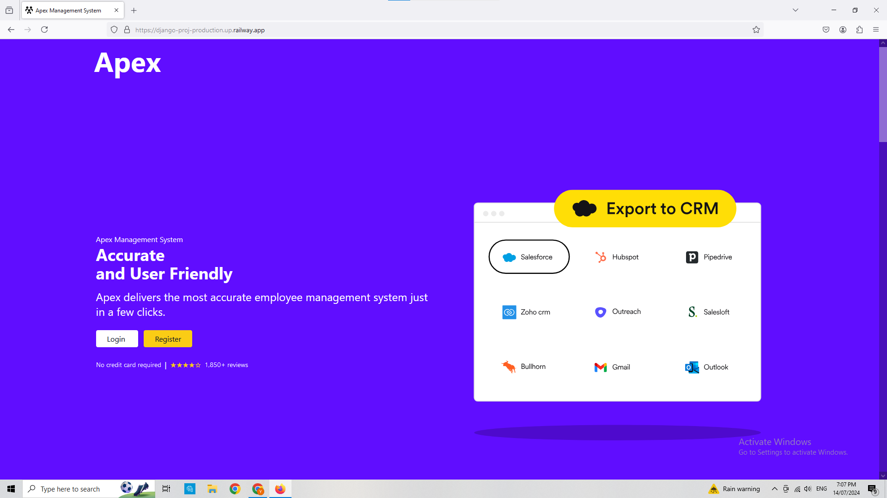

# Employee-Management-System

The Apex management system was created to organize employee data and key functions within their HR department, including recruitment & onboarding, time and attendance tracking, performance management, training & development, payroll, and benefits administration.

The live application can be viewed here :
https://django-proj-production.up.railway.app/

# Purpose and Target Audience:
 **Problem Statement:** Employee information is often scattered across different spreadsheets, documents, and databases, making it difficult to access and manage.

**Purpose:** To store and manage all employee-related data in a centralized, easily accessible database, ensuring data accuracy and consistency.

**Target Audience:** HR professionals, business executives, line managers, employees, IT staff, recruitment teams, compliance officers, and administrative staff.

# Persona and User Stories:

Daisy has over 10 years of experience in human resources and is focused on improving employee engagement and operational efficiency. She is tech-savvy and values data-driven decision-making.

## User Stories:

* Onboarding New Employees

* As an HR Manager, I want to automate the onboarding process, so that new hires can complete necessary paperwork and training efficiently.

* As a Department Supervisor, I want to track employee attendance in real-time, so that I can manage schedules and assess productivity.

* As an HR Manager, I want to set up a structured performance review process, so that employee evaluations are consistent and objective.

* As an Employee, I want to access my personal information and update my details through a self-service portal, so that I can manage my data easily.

* As an Employee, I want to submit leave requests online, so that I can streamline the approval process without paperwork delays.

* As a CFO, I want to generate payroll and compliance reports easily, so that I can ensure accurate financial planning and regulatory adherence.

* As a Learning and Development Manager, I want to track employee training progress, so that I can identify skill gaps and plan further development.

* As a Department Supervisor, I want to collect real-time feedback from my team, so that I can address concerns and improve team dynamics.

* As an IT Administrator, I want to implement role-based access controls, so that sensitive employee information is protected from unauthorized access.

* As a Recruiter, I want to manage job postings and track applicant statuses, so that I can streamline the recruitment process and fill positions faster.

## Wireframe & Initial Design:

## Agile:
This project was created using Agile principles via a projectboard on Github. This is the first time I have implemented Agile as an individual developer. However, creating user stories and identifying accepterance criteria acted as a roadmap to target the various features and functionalities of the application. It helped me stay on track and reduced distractions.

# Design Choices:

## Colour scheme:

Purple - Header

White & Yellow - Buttons

Purple - Footer

## Typography:
 The following fonts were chosen for a clean and modern look that is both readable and minimal.

#### Home Page:

The landing page provides an introduction to the website with a register button encouraging new users to sign up. Signing up and logging in allows them access the dashboard and to edit their details.
 
# Features

#### Login:

#### Register/Sign Up:

#### Admin Control:

#### Dashboard:

#### User Profile:

#### Admin Verification:

# Database Diagram

# Data Models Used

#### OneToOneField

#### CharField

#### ForeignKey

#### DecimalField

#### DateField

#### ImageField

#### BooleanField

# Responsiveness

#### Browsers

#### Google Chrome

#### Firefox

#### Safari (Phone)

# Links

#### Deployment
https://django-proj-production.up.railway.app/

#### Github Repository
https://github.com/yazanelmasri/Employee-Management-System

#### Kanban Board
https://github.com/users/yazanelmasri/projects/5

# Tools & Technologies

* Python used as the back-end programming language.
* Git used for version control. (git add, git commit, git push)
* GitHub used for secure online code storage.
* GitHub Pages used for hosting the deployed front-end site.
* Gitpod used as a cloud-based IDE for development.
* Gitpod used for Agile management.
* Tailwind used as the front-end HTML/CSS framework for modern responsiveness and pre-built components.
* SQLite3 used as the Postgres database.
* Railway used for deploying the project.
* Cloudinary used for online static file storage.
* Balsamiq used for collaborative design and prototyping(wireframes).

# Languages

Front End: HTML/Tailwind
Back End: Python/Django

# Deployment

Railway is an excellent and straight forward hastle-free backend deployment tool that I used to deploy my project.

# Bugs

All the bugs that occured during the creation of this application have been resolved.

# Credits: 

* Although I used the django blog resources provided on the LMS, I also received alot of additional clarification by following along with django projects on YouTube. One of the best vidoes I found helpful was : https://www.youtube.com/watch?v=rHux0gMZ3Eg&t=160s

* Stack Overflow was used to solve any smaller bugs and further clarification on errors I was receiving in the terminal.

* A special thanks to all the Code Academy tutors and managers for their continuous support throughout the course.

* The design and details were taken from the different management system websites.

